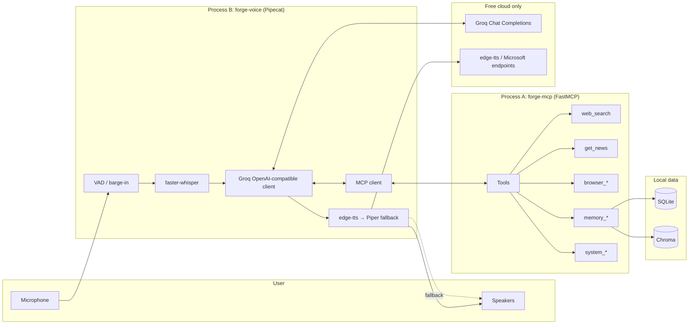

# Spec: forge-os

**Persona:** Forge  
**Tagline:** A local-first Tony-Stark-style voice assistant — multi-tool agent with free/self-hosted stack only (no paid API keys).  
**License:** MIT  
**Status:** Draft for human review (Phase 1 — Specify). No production code until this SPEC is approved.

---

## Assumptions (correct me now)

1. **Groq free-tier API key is allowed.** It is free (no credit card required for the free tier) and is the only cloud credential. No paid STT/TTS/LLM/browser providers.
2. **Target machine:** a normal laptop. Default path is **CPU-only**. GPU (CUDA) is optional and documented, not required for the holiday MVP demo.
3. **OS for MVP:** **Linux-first** (authoritative runbook/tests). macOS is best-effort with audio/ffmpeg notes in docs; Windows is explicitly unsupported for MVP (may work by accident).
4. **Two long-running processes** for the demo: (A) FastMCP tool server, (B) Pipecat voice agent. Memory (SQLite + Chroma) lives inside the MCP process (or a shared `memory/` package imported by MCP).
5. **English-first** voice UX for MVP. Multilingual STT/TTS is Phase 3+.
6. **Interrupt = barge-in:** user speech during TTS **or while tools are running** cancels playback, **abandons in-flight tool calls** (best-effort; ignore late results), and starts a new turn (simple VAD). Not full-duplex conversation.
7. **No GUI in MVP.** Terminal logs + spoken replies are enough for the holiday showcase. Optional TUI is Phase 3.
8. **Package layout:** uv workspace / monorepo with shared Python packages under the repo root; Python **3.11+**.

→ If any of these are wrong, say so before implementation starts.

---

## 1. Vision & success criteria

### What we’re building

Forge is a personal, demo-friendly FRIDAY/JARVIS-style voice OS:

- You speak into a local microphone.
- Local STT (faster-whisper) turns speech into text.
- A Groq LLM reasons and calls tools exposed by a local FastMCP server.
- Forge speaks back via edge-tts (Piper fallback).
- Tools cover search, news, browser, memory, and basic system utils — all free/self-hosted.

### Who it’s for

- You (developer / demoer) on a holiday side project.
- Secondary: friends watching a live mic demo (“watch this”).

### Success = holiday MVP demo is “done” when

You can, on a cold laptop with only a free Groq key + local deps:

1. Start MCP server + voice agent with documented commands.
2. Say: *“Forge, what’s the top tech news today?”* → Forge uses RSS (and/or search), summarizes aloud.
3. Say: *“Remember that my demo project is called forge-os.”* → stored in SQLite + vector memory.
4. Say: *“What did I ask you to remember about my project?”* → semantic/structured recall works.
5. Say: *“Search DuckDuckGo for Pipecat voice agents and tell me one useful fact.”* → search tool runs; spoken answer cites something plausible.
6. (Phase 2 demo stretch) Say: *“Open example.com and tell me the page title.”* → Playwright runs locally and answers.
7. End-to-end latency on CPU feels usable for a demo: typically **under ~8–12s** for a short question with one tool call (Whisper `base` + Groq + edge-tts). Not studio-grade; demo-grade.

### Explicit non-success for holiday MVP (do not optimize for yet)

These are **post-MVP roadmap** (SPEC §12 Phases 3–6), not abandoned:

- Always-on wake word in the background → Phase 3
- Zero-cloud offline LLM → Phase 4 (Groq remains MVP default)
- Phone calling / SIP → Phase 5
- Multi-agent “C-suite” dashboards → Phase 6
- Mobile apps → still out of scope (not on roadmap)

---

## 2. Repository name & layout

**Repository:** `forge-os`

```text
forge-os/
├── SPEC.md                 # This document (source of truth)
├── README.md               # Quickstart pointing at SPEC + runbook
├── LICENSE                 # MIT (already present)
├── pyproject.toml          # uv workspace root
├── uv.lock
├── .env.example
├── .gitignore
│
├── configs/
│   ├── default.yaml        # Models, whisper size, TTS, RSS feeds, paths
│   ├── cpu.yaml            # Overrides for CPU-only laptops
│   └── gpu.yaml            # Overrides when CUDA is available
│
├── voice/                  # Pipecat voice pipeline (process B)
│   ├── pyproject.toml
│   ├── forge_voice/
│   │   ├── __init__.py
│   │   ├── main.py         # CLI entry: forge-voice
│   │   ├── pipeline.py     # listen → STT → LLM/tools → TTS
│   │   ├── llm.py          # OpenAI-compatible Groq client + tool loop
│   │   ├── stt.py          # faster-whisper wrapper
│   │   ├── tts.py          # edge-tts primary, Piper fallback
│   │   ├── mcp_client.py   # discover & call MCP tools
│   │   └── persona.py      # system prompt / “Forge” voice style
│   └── tests/
│
├── mcp_server/             # FastMCP tool backend (process A)
│   ├── pyproject.toml
│   ├── forge_mcp/
│   │   ├── __init__.py
│   │   ├── server.py       # FastMCP app + tool registration
│   │   ├── tools/
│   │   │   ├── search.py
│   │   │   ├── news.py
│   │   │   ├── browser.py
│   │   │   ├── memory_tools.py
│   │   │   └── system.py
│   │   └── adapters/       # DDG / SearXNG / RSS / Playwright thin wrappers
│   └── tests/
│
├── memory/                 # Shared memory library (imported by mcp_server)
│   ├── pyproject.toml
│   ├── forge_memory/
│   │   ├── __init__.py
│   │   ├── sqlite_store.py
│   │   ├── vector_store.py # Chroma (default); FAISS adapter stub optional
│   │   └── schema.py
│   └── tests/
│
├── docs/
│   ├── contracts.md        # Normative API/env/MCP contracts (CONTRACT_VERSION=1)
│   ├── architecture.md     # Optional long-form; SPEC is enough for MVP
│   ├── demo-script.md      # Copy of § Demo script for printout
│   └── runbook.md          # Ops notes, troubleshooting
│
├── examples/
│   ├── hello_stt.py
│   ├── hello_tts.py
│   └── sample_queries.md
│
├── data/                   # gitignored runtime data
│   ├── sqlite/
│   ├── chroma/
│   └── piper/              # downloaded Piper voices (gitignored)
│
└── scripts/
    ├── bootstrap.sh        # uv sync, playwright install, optional piper fetch
    └── demo_checklist.sh   # prints demo steps / health checks
```

**Workspace note:** Use `uv` workspace members: `voice`, `mcp_server`, `memory`. Shared types/config helpers may live in a thin `packages/forge_common/` later if duplication hurts; **do not create it in Phase 0** unless needed.

---

## 3. Architecture

### 3.1 Component diagram



### 3.2 Data / control flow — one voice turn

```mermaid
sequenceDiagram
  participant U as User
  participant V as Voice pipeline
  participant W as Whisper
  participant G as Groq
  participant M as MCP server
  participant T as TTS

  U->>V: Speak (audio frames)
  V->>V: VAD end-of-utterance
  V->>W: PCM / wav segment
  W-->>V: transcript text
  V->>G: chat + tool schemas (from MCP list_tools)
  alt tool calls needed
    G-->>V: tool_calls[]
    V->>M: tools/call
    M-->>V: tool result JSON
    V->>G: tool results appended
  end
  G-->>V: final assistant text
  V->>T: synthesize speech
  T-->>U: audio playback
  Note over U,V: Barge-in: cancel TTS + abandon in-flight tools; start new turn
```

### 3.3 Process model (what runs where)

| Process | Command (see §9) | Responsibility |
|--------|-------------------|----------------|
| **A — MCP** | `uv run forge-mcp` | FastMCP over **SSE** (default for voice) or stdio (CLI/debug). Hosts all tools + memory. |
| **B — Voice** | `uv run forge-voice` | Mic capture, VAD, STT, Groq tool loop, TTS playback, MCP client. |
| **Optional C** | SearXNG docker | Only if `SEARCH_BACKEND=searxng`. Not required for MVP. |

**Why SSE default for MCP:** Voice and tools are separate processes; SSE is simpler than parenting stdio from Pipecat and matches “Friday-style split.” Stdio remains supported for `mcp` CLI debugging and single-process experiments.

**Terminals for demo:** two terminals (or one tmux session with two panes).

---

## 4. Tech choices & rationale

| Layer | Choice | Why | Tradeoffs / free-tier risks |
|------|--------|-----|-------------------------------|
| LLM | **Groq** via OpenAI-compatible client (`openai` Python SDK, `base_url=https://api.groq.com/openai/v1`) | Free tier, fast, swap models by env | Org-level RPM/TPM/RPD caps; demos can hit 429s |
| Default model | `llama-3.3-70b-versatile` | Strong free production model; solid tool calling for MVP | Lower daily request budget than 8B; fallback required |
| Fallback models | `openai/gpt-oss-20b` → `llama-3.1-8b-instant` | Speed / higher free headroom when rate-limited | Quality drop; tool-calling may need tighter prompts |
| STT | `faster-whisper` | Local, free, good quality | CPU latency; model size tradeoff |
| TTS primary | `edge-tts` | No API key, natural voices | Needs network; can fail / rate-limit / region issues |
| TTS fallback | **Piper** (local ONNX) | Fully offline once voice downloaded | More setup; robotic vs edge-tts |
| Voice framework | **Pipecat** + local mic (no LiveKit Cloud) | Modular frames/processors; interruptible loop | Learning curve; keep pipeline minimal |
| Tools | **FastMCP** | Clean MCP server; dynamic tool discovery | Extra process vs in-process tools |
| Search | DuckDuckGo (`ddgs` / `duckduckgo-search`) | Free, no key | Result quality / blocking; HTML fragility |
| Search optional | SearXNG URL | Self-hosted privacy / stability | Ops overhead |
| News | RSS via `feedparser` | Free, reliable | Feed rot; need curated list |
| Browser | Local **Playwright** | No Browserbase | Install size; flaky sites; security (URL allowlist) |
| Memory structured | SQLite | Simple, portable | Not multi-user |
| Memory semantic | **Chroma** | Easy DX for holiday project | FAISS noted as alt if Chroma pain |
| Packaging | **uv** + Python 3.11+ | Fast, modern | Team must use uv |

### Groq model policy (configurable)

```yaml
# configs/default.yaml (conceptual)
llm:
  provider: groq
  base_url: https://api.groq.com/openai/v1
  model: llama-3.3-70b-versatile
  fallback_models:
    - openai/gpt-oss-20b
    - llama-3.1-8b-instant
  max_tool_rounds: 4
  temperature: 0.4
```

On **429 / rate limit / model deprecation errors**: retry once with backoff, then automatically try the next fallback model. Log clearly: `Forge: switching LLM to …`.

**Do not** use Groq’s hosted Whisper for MVP STT — keep STT local so the voice loop works if Groq is only needed for reasoning, and to avoid burning Groq ASR quota.

### Whisper size tradeoffs

| Model | CPU (approx) | GPU | Demo recommendation |
|-------|--------------|-----|---------------------|
| `tiny` | Fastest, more errors | Overkill | Noisy rooms / desperate CPU |
| `base` | **Default for CPU demos** | Fine | Holiday MVP default |
| `small` | Noticeably slower on CPU | Good quality | Prefer if CUDA available |
| `medium+` | Too slow for interactive CPU demo | Optional | Out of MVP scope |

### TTS fallback triggers

Use Piper when **any** of:

1. `TTS_PROVIDER=piper` forced in config/env.
2. `edge-tts` raises / times out (default timeout **10s**).
3. Offline mode: `FORGE_OFFLINE=1` or no network route to edge endpoints.
4. Configured edge voice missing / rejected → try one alternate edge voice, then Piper.

Piper voice default (CPU-friendly): `en_US-lessac-medium` (download via bootstrap script into `data/piper/`).

---

## 5. MVP feature list (P0)

### User stories (must-have)

1. **As a user**, I can start Forge and speak a wake-free utterance; Forge transcribes and replies by voice.
2. **As a user**, I can ask the time/date; Forge answers via `system_time` without hallucinating wildly.
3. **As a user**, I can ask for news; Forge fetches configured RSS feeds and summarizes.
4. **As a user**, I can ask Forge to web-search a query; Forge returns a short spoken summary of top results.
5. **As a user**, I can tell Forge to remember a fact; it persists across restarts (SQLite + Chroma).
6. **As a user**, I can ask Forge to recall a past fact by meaning (“what project am I demoing?”).
7. **As a user**, I can interrupt Forge while it is speaking or tool-calling; TTS stops, in-flight tools are abandoned, and my new utterance starts a fresh turn.
8. **As a developer**, I can swap Whisper size / Groq model / TTS provider via config/env without code edits.
9. **As a developer**, the voice agent loads tool schemas dynamically from MCP (`list_tools`), not a hardcoded Python tool list duplicated in two places.

### P0 engineering requirements

- `.env.example` documents every required var.
- `configs/default.yaml` + `cpu.yaml` work on a normal laptop.
- MIT license retained.
- README can run a stranger through setup in ≤15 minutes (excluding large model downloads).

---

## 6. Phase plan

### Phase 0 — Skeleton + hello voice loop (no tools) — **~1–2 days**

- uv workspace, packages, configs, `.env.example`.
- Local mic → VAD → faster-whisper → Groq chat (no tools) → edge-tts → speakers.
- Barge-in: cancel TTS **and** abandon in-flight tool calls (ignore late results); start new turn.
- Persona system prompt: “You are Forge…”
- **Exit criteria:** spoken Q&A works with zero MCP.

### Phase 1 — MCP tools wired (search / news / memory / system) — **~2–4 days**

- FastMCP server SSE + stdio.
- Tools: `web_search`, `get_news`, `memory_store`, `memory_recall`, `memory_list_recent`, `system_time`, `notes_add`, `notes_list`.
- Voice LLM tool loop + dynamic MCP schemas.
- SQLite + Chroma behind memory tools.
- **Exit criteria:** demo stories 2–6 in §1 work.

### Phase 2 — Playwright + TTS polish — **~2–3 days**

- `browser_navigate`, `browser_get_text`, `browser_snapshot` (tight allowlist / confirm dangerous ops).
- Piper fallback path + bootstrap download.
- Retry/fallback model switching for Groq.
- **Exit criteria:** browser title demo + offline/Piper spoken reply works.

### Phase 3 (optional) — Niceties — **as time allows**

Moved into a fuller **post-MVP roadmap** (SPEC §12): wake word (Phase 3), offline LLM (Phase 4), SIP (Phase 5), C-suite dashboards (Phase 6). See `tasks/todo.md` backlog. **Not MVP-blocking.**

---

## 7. Interfaces / contracts

**Normative detail:** [`docs/contracts.md`](docs/contracts.md) (`CONTRACT_VERSION = 1`). SPEC §7 is the summary; if this section and `docs/contracts.md` diverge, **fix contracts and update this section**.

### 7.1 Environment variables

| Variable | Required | Default | Owner | Purpose |
|----------|----------|---------|-------|---------|
| `GROQ_API_KEY` | **Yes** | — | voice | Free Groq key |
| `GROQ_BASE_URL` | No | `https://api.groq.com/openai/v1` | voice | OpenAI-compatible base |
| `FORGE_LLM_MODEL` | No | `llama-3.3-70b-versatile` | voice | Primary chat model |
| `FORGE_LLM_FALLBACKS` | No | `openai/gpt-oss-20b,llama-3.1-8b-instant` | voice | CSV fallbacks |
| `FORGE_CONFIG` | No | `configs/default.yaml` | voice (+ MCP for feeds/browser) | Config path |
| `WHISPER_MODEL` | No | `base` | voice | `tiny` / `base` / `small` |
| `WHISPER_DEVICE` | No | `cpu` | voice | `cpu` or `cuda` |
| `WHISPER_COMPUTE_TYPE` | No | `int8` (if cuda + unset → `float16`) | voice | faster-whisper compute |
| `TTS_PROVIDER` | No | **`auto`** | voice | `auto` \| `edge` \| `piper` |
| `EDGE_TTS_VOICE` | No | `en-US-GuyNeural` | voice | Forge default voice |
| `PIPER_MODEL_PATH` | No | `{FORGE_DATA_DIR}/piper/en_US-lessac-medium.onnx` | voice | Local voice |
| `PIPER_BIN` | No | `piper` | voice | Executable |
| `MCP_TRANSPORT` | No | `sse` | mcp | `sse` \| `stdio` |
| `MCP_HOST` | No | `127.0.0.1` | mcp | Bind address |
| `MCP_PORT` | No | `8765` | mcp | SSE port |
| `MCP_URL` | No | `http://127.0.0.1:8765/sse` | voice | Full SSE URL for voice client |
| `SEARCH_BACKEND` | No | `ddg` | mcp | `ddg` \| `searxng` |
| `SEARXNG_URL` | No | — | mcp | e.g. `http://127.0.0.1:8080` |
| `FORGE_DATA_DIR` | No | `./data` | both | Runtime root for sqlite/chroma/piper defaults |
| `FORGE_OFFLINE` | No | `0` | voice | MVP: force Piper / skip edge (not offline LLM yet) |
| `BROWSER_HEADLESS` | No | `1` | mcp | Playwright |
| `BROWSER_ALLOWLIST` | No | `example.com,*.wikipedia.org` | mcp | Comma host patterns |
| `BROWSER_ALLOW_ALL` | No | `0` | mcp | `1` skips allowlist (discouraged) |
| `FORGE_PERSONA_NAME` | No | `Forge` | voice | Spoken name |

Secrets: only `GROQ_API_KEY` in `.env` (gitignored). Never commit real keys.  
Precedence: **env overrides yaml**.

### 7.2 MCP tool schemas (MVP)

Exact JSON in/out: [`docs/contracts.md`](docs/contracts.md) §2–§4.

**Envelope:** success always includes `"ok": true`. Errors:

```json
{ "ok": false, "error": "Human-readable message", "code": "MACHINE_CODE" }
```

Tools: `web_search`, `get_news`, `memory_store`, `memory_recall`, `memory_list_recent`, `notes_add`, `notes_list`, `system_time`, and Phase 2 `browser_navigate` / `browser_get_text` / `browser_snapshot`.

**Notes (frozen):**

- `notes_add` → `{ "ok": true, "id": "<uuid>" }`
- `notes_list` → `{ "ok": true, "items": [ { "id", "title", "body", "created_at" } ] }`

**memory_list_recent items:** `{ "id", "text", "created_at", "tags" }` (no score).

**Safety:** navigate only if URL host matches `BROWSER_ALLOWLIST` unless `BROWSER_ALLOW_ALL=1`.

### 7.3 Memory schema

Paths: default SQLite `{FORGE_DATA_DIR}/sqlite/forge.db`, Chroma `{FORGE_DATA_DIR}/chroma`. Absolute yaml paths win; relative yaml paths resolve against process cwd. Details: `docs/contracts.md` §3.

**Ownership:** voice writes `turns`; MCP writes `memories` + `notes` (+ Chroma).

#### SQLite (`{FORGE_DATA_DIR}/sqlite/forge.db`)

```sql
CREATE TABLE turns (
  id TEXT PRIMARY KEY,
  role TEXT NOT NULL,          -- user|assistant|tool
  content TEXT NOT NULL,
  created_at TEXT NOT NULL
);

CREATE TABLE memories (
  id TEXT PRIMARY KEY,
  text TEXT NOT NULL,
  tags TEXT NOT NULL DEFAULT '[]',  -- JSON array
  importance INTEGER NOT NULL DEFAULT 1,
  created_at TEXT NOT NULL,
  chroma_id TEXT
);

CREATE TABLE notes (
  id TEXT PRIMARY KEY,
  title TEXT NOT NULL,
  body TEXT NOT NULL,
  created_at TEXT NOT NULL
);
```

#### Chroma collection

- **Name:** `forge_memories`
- **Embedding:** default Chroma embedding function for MVP
- **Metadata:** `{ "sqlite_id", "tags", "importance", "created_at" }` where `tags` is a **JSON array string** (e.g. `"[\"demo\"]"`)
- **Document:** memory `text`

FAISS alternative: same `VectorStore` protocol (`add`, `query`, `delete`); not implemented in Phase 1.

### 7.4 Voice ↔ MCP

See `docs/contracts.md` §5: `list_tools` → Groq `tool_calls` → `call_tool` → append results → final TTS. Barge-in abandons in-flight tools. Compatibility / additive rules: `docs/contracts.md` §6.

---

## 8. Configuration

`configs/default.yaml` (authoritative knobs; env overrides win):

```yaml
persona:
  name: Forge
  style: "Concise, competent, slightly dry wit. Confirm tool actions briefly."

llm:
  model: llama-3.3-70b-versatile
  fallback_models:
    - openai/gpt-oss-20b
    - llama-3.1-8b-instant
  max_tool_rounds: 4
  temperature: 0.4

stt:
  model_size: base          # CPU default
  device: cpu
  compute_type: int8

tts:
  provider: auto            # default; env TTS_PROVIDER overrides
  edge_voice: en-US-GuyNeural
  piper_model: data/piper/en_US-lessac-medium.onnx
  speak_timeout_s: 10

vad:
  silence_ms: 700
  min_utterance_ms: 400

mcp:
  transport: sse
  url: http://127.0.0.1:8765/sse

search:
  backend: ddg
  searxng_url: null
  max_results: 5

news:
  feeds:
    tech:
      - https://feeds.arstechnica.com/arstechnica/technology-lab
      - https://www.theverge.com/rss/index.xml
      - https://hnrss.org/frontpage
    world:
      - https://feeds.bbci.co.uk/news/world/rss.xml
    science:
      - https://www.sciencedaily.com/rss/all.xml

browser:
  headless: true
  allowlist:
    - example.com
    - "*.wikipedia.org"

memory:
  sqlite_path: data/sqlite/forge.db
  chroma_path: data/chroma
  collection: forge_memories
```

`configs/cpu.yaml`: `stt.model_size: base`, `stt.device: cpu`.  
`configs/gpu.yaml`: `stt.model_size: small`, `stt.device: cuda`, `stt.compute_type: float16`.

---

## 9. Local setup & runbook

### Prerequisites

| Dependency | CPU path | GPU path | Notes |
|------------|----------|----------|-------|
| Python 3.11+ | Required | Required | |
| [uv](https://docs.astral.sh/uv/) | Required | Required | Package manager |
| `ffmpeg` | Recommended | Recommended | Audio decode/resample helpers |
| PortAudio / system mic | Required | Required | `sounddevice` / Pipecat local transport deps |
| Playwright browsers | Phase 2 | Phase 2 | `uv run playwright install chromium` |
| Piper binary + ONNX voice | Optional until fallback tested | Optional | Bootstrap script |
| CUDA + cuDNN | No | Yes | Only for Whisper GPU |
| Groq free API key | Required | Required | https://console.groq.com |
| Docker + SearXNG | Optional | Optional | Phase 3 |

### Bootstrap

```bash
cd forge-os
cp .env.example .env   # set GROQ_API_KEY

uv sync
uv run scripts/bootstrap.sh
# Phase 2+:
uv run playwright install chromium
```

### Run (two terminals)

```bash
# Terminal A — tools
uv run forge-mcp --transport sse --host 127.0.0.1 --port 8765

# Terminal B — voice
uv run forge-voice --config configs/cpu.yaml
# or GPU:
uv run forge-voice --config configs/gpu.yaml
```

### Health checks

```bash
uv run forge-mcp --list-tools
uv run python examples/hello_tts.py
uv run python examples/hello_stt.py   # speak once
```

### CPU-only path vs GPU path

- **CPU (default):** Whisper `base` + `int8`, edge-tts, expect multi-second STT.
- **GPU:** Whisper `small` + `float16`, same LLM/TTS; snappier demos.

---

## 10. Testing strategy

### Automated (pytest)

| Area | Location | What |
|------|----------|------|
| Memory SQLite/Chroma | `memory/tests/` | store/recall/list; restart persistence |
| Search/news adapters | `mcp_server/tests/` | mock HTTP; parse fixtures |
| Tool schema contracts | `mcp_server/tests/` | input validation / error shape |
| LLM fallback selection | `voice/tests/` | 429 → next model (mocked) |
| TTS provider selection | `voice/tests/` | edge fail → piper |

**Coverage expectation:** meaningful unit tests on tools/memory; not 100% line coverage theater. Voice pipeline E2E is mostly manual.

### Manual holiday demo script

See **§ Demo script** below. Run once on the demo machine the night before; fix mic permissions / rate limits early.

### Commands

```bash
uv run pytest
uv run ruff check .
uv run ruff format --check .
```

---

## 11. Risks & mitigations

| Risk | Impact | Mitigation |
|------|--------|------------|
| Groq 429 / daily caps | Demo dies mid-sentence | Fallback model chain; keep prompts short; cache nothing sensitive; warm up with 8B if needed |
| edge-tts failure / slow | Silence | Auto Piper; pre-download voice; `FORGE_OFFLINE=1` rehearsal |
| Whisper latency on CPU | Awkward pauses | Default `base`; show “thinking” LED/log; avoid `small` on CPU |
| DDG blocking / empty results | Search looks broken | SearXNG optional; degrade to “search unavailable” spoken error |
| Playwright flakiness | Browser tool fails live | Strict allowlist; demo only `example.com` + Wikipedia; headless screenshots optional later |
| MCP process down | No tools | Voice detects connect fail and says tools offline; still chitchats |
| Mic / PipeWire / Pulse issues | No input | Document `arecord -l`; example STT script; prefer wired headset for demos |
| Chroma embedding downloads | First-run delay | Bootstrap pulls embeddings; document offline constraint |
| Model ID churn on Groq | Config breaks | Centralize model IDs; document `uv run` check against `/v1/models` |

---

## 12. Non-goals & future ideas

### Non-goals (v1 / holiday MVP — Phases 0–2)

These are **out of scope for the holiday MVP demo**, not forever abandoned:

- Mobile app
- Paid STT/TTS/LLM (OpenAI, ElevenLabs, Deepgram, Browserbase, etc.)
- Cloud browser sandboxes
- Home Assistant / smart-home control

### Post-MVP roadmap (explicit — after Phase 2)

Tracked in `tasks/todo.md` Phase 3+ backlog and **normative reserved contracts** in [`docs/contracts.md`](docs/contracts.md) §9. Still free/self-hosted only.

| Phase | Theme | Outcome |
|-------|--------|---------|
| **3** | Always-on wake word | Background openWakeWord (“Hey Forge”); push-to-talk remains available |
| **4** | Zero-cloud offline LLM | Local LLM (Ollama or equivalent) as Groq alternative when offline / `FORGE_OFFLINE=1`; Groq remains default when online |
| **5** | Phone / SIP | Free/self-hosted SIP path (e.g. Asterisk/FreeSWITCH + local softphone); no paid telephony APIs |
| **6** | Multi-agent C-suite dashboards | Multi-agent roles + simple local web dashboard (not a commercial APEX clone); still modular MCP tools |

### Smaller future ideas (backlog)

- SearXNG adapter, FAISS backend, hybrid BM25 + vector
- Better memory (chunking, auto-index turn transcripts)
- Simple CLI/TUI status (mic level, last tool, model)
- Vision tool (local webcam + VLM if free model appears)
- Calendar / email via local IMAP (careful with secrets)
- Multi-profile personas

---

## Demo script (one page)

**Setup (5 min before audience):**

1. Plug in headset mic; `uv run forge-mcp` then `uv run forge-voice --config configs/cpu.yaml`.
2. Confirm logs: `STT ready (base/cpu)`, `MCP tools: N`, `TTS: edge`.
3. Say a throwaway: “Forge, what time is it?”

**Live script:**

| # | You say | Expected |
|---|---------|----------|
| 1 | “Forge, what time is it?” | Speaks local time via `system_time`. |
| 2 | “What’s the top tech news today?” | Calls `get_news`; summarizes 2–3 headlines aloud. |
| 3 | “Remember that my holiday project is called forge-os.” | `memory_store`; brief confirmation. |
| 4 | “What holiday project am I working on?” | `memory_recall` → “forge-os”. |
| 5 | “Search for Pipecat voice agents and give me one useful fact.” | `web_search` → one crisp fact. |
| 6 | *(Phase 2)* “Open https://example.com and tell me the page title.” | Playwright → “Example Domain”. |
| 7 | *(Interrupt)* Start asking news, then talk over the reply | TTS stops; new turn begins. |

**If Groq rate-limits:** Forge should announce fallback model or ask you to retry in a minute — practice this once.

**If edge-tts fails:** Piper voice continues the demo (less pretty, still alive).

---

## 13. First implementation checklist

Ordered for an agent/developer. Do not skip Phase gates.

### Phase 0

1. [ ] Create uv workspace `pyproject.toml` + members `voice`, `mcp_server`, `memory`.
2. [ ] Add `.env.example`, `configs/{default,cpu,gpu}.yaml`, expand `.gitignore` for `data/`, `.env`.
3. [ ] Implement `forge_voice.stt` (faster-whisper) + `examples/hello_stt.py`.
4. [ ] Implement `forge_voice.tts` (edge-tts only first) + `examples/hello_tts.py`.
5. [ ] Wire Pipecat (or minimal loop if Pipecat local mic is sticky) listen → STT → Groq text → TTS.
6. [ ] Add barge-in cancellation (TTS + abandon in-flight tools).
7. [ ] README quickstart for hello loop.

### Phase 1

8. [ ] `forge_memory` SQLite + Chroma with tests.
9. [ ] FastMCP server with system/search/news/memory/notes tools + tests (mocked network).
10. [ ] Voice MCP client: `list_tools` → Groq tools → `call_tool` loop.
11. [ ] End-to-end manual demo steps 1–5.

### Phase 2

12. [ ] Playwright tools + allowlist.
13. [ ] Piper fallback + bootstrap download script.
14. [ ] Groq model fallback on 429.
15. [ ] Demo step 6 + interrupt rehearsal.

### Phase 3+ (post-MVP — see `tasks/todo.md`)

16. [ ] Phase 3: always-on wake word  
17. [ ] Phase 4: zero-cloud offline LLM (Ollama)  
18. [ ] Phase 5: phone/SIP  
19. [ ] Phase 6: multi-agent C-suite dashboards  
20. [ ] Niceties: SearXNG, TUI status, memory improvements, FAISS  

---

## Code style (for implementers)

- Python 3.11+; type hints on public functions.
- `ruff` for lint/format.
- Package imports: `forge_voice`, `forge_mcp`, `forge_memory`.
- Prefer small pure functions in adapters; keep Pipecat processors thin.
- No secrets in logs; truncate tool payloads in debug logs.

Example shape:

```python
async def synthesize(text: str, *, provider: str = "auto") -> bytes:
    """Return WAV/PCM bytes. provider: edge | piper | auto."""
    ...
```

---

## Boundaries

- **Always:** keep stack free/self-hosted per SPEC; run unit tests for memory/tools before claiming Phase 1 done; update SPEC when decisions change.
- **Ask first:** adding paid providers; changing license; adding new long-running infra (Docker services beyond optional SearXNG); expanding browser allowlist to “all sites” by default.
- **Never:** commit `.env` / API keys; remove failing tests to go green; silently replace Groq with a paid LLM.

---

## Success criteria (testable)

- [ ] Two-process demo runs on CPU-only laptop with free Groq key.
- [ ] P0 user stories 1–9 satisfied (browser story may wait for Phase 2).
- [ ] MCP tool list is dynamic from the server.
- [ ] Memory persists across process restarts.
- [ ] edge-tts failure triggers Piper without crashing the pipeline.
- [ ] SPEC sections 1–13 remain accurate after implementation (update if not).

---

## Open questions (for grill / human)

All MVP open questions resolved. Remaining items are Deferred (Phase 3+): wake word, SearXNG, FAISS.

1. ~~Confirm default Groq model~~ → **Locked:** `llama-3.3-70b-versatile`; fallbacks `openai/gpt-oss-20b` → `llama-3.1-8b-instant`.
2. ~~Confirm MCP transport default~~ → **Locked:** SSE primary (`http://127.0.0.1:8765/sse`); stdio supported for CLI/debug only.
3. ~~Confirm barge-in semantics~~ → **Locked:** cancel TTS + abandon in-flight tools (best-effort); start fresh turn.
4. ~~edge-tts voice~~ → **Locked:** `en-US-GuyNeural` (override via `EDGE_TTS_VOICE`).
5. ~~Platform~~ → **Locked:** Linux-first; macOS best-effort docs; Windows unsupported for MVP.

---

## Recommended first PR / first commit plan

### Commit 0 / PR 0 — “docs: add SPEC for holiday MVP” (this change)

- Add `SPEC.md` only (plus tiny README stub pointing to it if desired).
- No application code.
- Goal: lock shared understanding before scaffolding.

### PR 1 — “chore: uv workspace skeleton + configs”

- `pyproject.toml` workspace, empty package stubs, `.env.example`, `configs/*.yaml`, `data/.gitkeep`, README quickstart placeholders.
- Verify: `uv sync` succeeds.

### PR 2 — “feat(voice): hello STT→LLM→TTS loop (Phase 0)”

- No MCP yet.
- Verify: manual mic round-trip.

### PR 3 — “feat(mcp): tools + memory (Phase 1)”

- FastMCP + memory + search/news/system.
- Verify: pytest + demo script items 1–5.

### PR 4 — “feat: playwright + piper fallback (Phase 2)”

- Verify: demo script item 6 + forced TTS fallback.

Each PR should reference the SPEC section it implements (`SPEC.md §6 Phase N`).

---

## Grill log (seed — refine with human)

### Resolved (from your brief)

- [stack] Free/self-hosted only; Groq free tier for LLM  
- [layout] `voice/` + `mcp_server/` + `memory/` + `configs/`  
- [STT] faster-whisper  
- [TTS] edge-tts primary, Piper fallback  
- [tools] FastMCP; DDG + RSS + Playwright + SQLite/Chroma  
- [persona] Forge; repo `forge-os`; MIT  
- [vector] Chroma default, FAISS later  
- [wake word] Phase 3 / optional  
- [llm] Primary `llama-3.3-70b-versatile`; fallbacks `openai/gpt-oss-20b` → `llama-3.1-8b-instant` (tool quality first; free-tier escape hatch)
- [mcp] SSE primary for voice↔tools; stdio for CLI/debug only
- [realtime] Barge-in cancels TTS and abandons in-flight tools (best-effort; ignore late results), then starts a new turn
- [platform] Linux-first; macOS best-effort docs; Windows unsupported for MVP
- [tts] edge-tts default voice `en-US-GuyNeural` (env-overridable)

### Open

- _(none)_

### Deferred

- [wake-word] openWakeWord always-on — **Phase 3** post-MVP  
- [offline-llm] Ollama (or equiv.) zero-cloud reasoning — **Phase 4** (Groq remains MVP default)  
- [sip] Phone/SIP calling free/self-hosted — **Phase 5**  
- [csuite] Multi-agent C-suite dashboards — **Phase 6**  
- [searxng] optional adapter — revisit when DDG flakes  
- [faiss] if Chroma DX bites  

### Blocked

- _(none)_
