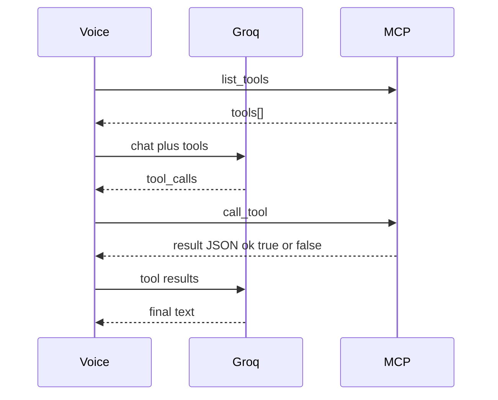

# forge-os contracts

**Status:** MVP (Phases 0–2) **frozen** at `CONTRACT_VERSION = 1`. Post-MVP Phases 3–6 are **reserved product contracts** for release roadmap (schemas finalize when each phase ships; version bumps 2–5).  
**Authority:** This file is the implementable contract. [SPEC.md](../SPEC.md) §7 / §12 must match; if they diverge, **fix this file and update SPEC**.  
**Resolved:** 2026-07-24 — C1A (`TTS_PROVIDER=auto`), C2A (`BROWSER_ALLOW_ALL`), C3–C8 and A1–A5 per senior defaults. Roadmap phases 3–6 included for release.

No application code lives here — schemas and rules only.

**Roadmap index**

| Phase | Theme | Contract section | Target `CONTRACT_VERSION` when shipped |
|-------|--------|------------------|----------------------------------------|
| 0–2 | Holiday MVP voice + MCP + browser | §1–§6 | **1** (current) |
| 3 | Always-on wake word | §9.1 | **2** |
| 4 | Zero-cloud offline LLM | §9.2 | **3** |
| 5 | Phone / SIP | §9.3 | **4** |
| 6 | Multi-agent C-suite dashboards | §9.4 | **5** |

---

## 1. Environment variables

**Precedence:** process env **overrides** `configs/*.yaml` for the same logical key.  
**Types:** unset → use Default. Boolean-like flags: `1`/`true`/`yes` = true; `0`/`false`/`no`/empty = false (case-insensitive).

| Name | Required | Default | Owner process | Notes |
|------|----------|---------|---------------|-------|
| `GROQ_API_KEY` | **Yes** (voice online) | — | **voice** | Only secret in `.env`. Not read by MCP. |
| `GROQ_BASE_URL` | No | `https://api.groq.com/openai/v1` | **voice** | OpenAI-compatible base |
| `FORGE_LLM_MODEL` | No | `llama-3.3-70b-versatile` | **voice** | Primary chat model |
| `FORGE_LLM_FALLBACKS` | No | `openai/gpt-oss-20b,llama-3.1-8b-instant` | **voice** | CSV, try in order after primary fails |
| `FORGE_CONFIG` | No | `configs/default.yaml` | **voice** (MCP may also load for feeds/browser) | Path to yaml |
| `WHISPER_MODEL` | No | `base` | **voice** | `tiny` \| `base` \| `small` |
| `WHISPER_DEVICE` | No | `cpu` | **voice** | `cpu` \| `cuda` |
| `WHISPER_COMPUTE_TYPE` | No | `int8` | **voice** | If unset and `WHISPER_DEVICE=cuda` → treat as `float16` |
| `TTS_PROVIDER` | No | **`auto`** | **voice** | `auto` \| `edge` \| `piper` |
| `EDGE_TTS_VOICE` | No | `en-US-GuyNeural` | **voice** | |
| `PIPER_MODEL_PATH` | No | `{FORGE_DATA_DIR}/piper/en_US-lessac-medium.onnx` | **voice** | |
| `PIPER_BIN` | No | `piper` | **voice** | On PATH or absolute |
| `MCP_TRANSPORT` | No | `sse` | **mcp** | `sse` \| `stdio` (stdio = debug/CLI) |
| `MCP_HOST` | No | `127.0.0.1` | **mcp** | Bind address (SSE) |
| `MCP_PORT` | No | `8765` | **mcp** | SSE port |
| `MCP_URL` | No | `http://127.0.0.1:8765/sse` | **voice** | Full SSE endpoint URL voice uses |
| `SEARCH_BACKEND` | No | `ddg` | **mcp** | `ddg` \| `searxng` |
| `SEARXNG_URL` | No | — | **mcp** | Required if backend=`searxng` |
| `FORGE_DATA_DIR` | No | `./data` | **both** | Runtime root; see §3 paths |
| `FORGE_OFFLINE` | No | `0` | **voice** | MVP: force Piper / skip edge. Phase 4 (§9.2) **extends** meaning to prefer local LLM — additive, documented there |
| `BROWSER_HEADLESS` | No | `1` | **mcp** | Playwright |
| `BROWSER_ALLOWLIST` | No | `example.com,*.wikipedia.org` | **mcp** | Comma-separated host patterns |
| `BROWSER_ALLOW_ALL` | No | `0` | **mcp** | `1` = skip allowlist (discouraged) |
| `FORGE_PERSONA_NAME` | No | `Forge` | **voice** | Spoken / system-prompt name |

**Owner legend**

- **voice** = `forge-voice` process only  
- **mcp** = `forge-mcp` process only  
- **both** = either may read; must interpret identically  

Secrets: never log `GROQ_API_KEY`. Never commit `.env`.

---

## 2. Shared tool result envelope

Every MCP tool **content** returned to the model is a JSON object (stringified in MCP `CallToolResult` text/JSON as implementation prefers, but semantics below are mandatory).

### Success

```json
{
  "ok": true
}
```

Plus tool-specific fields. `ok` is always boolean `true` on success.

### Error

```json
{
  "ok": false,
  "error": "Human-readable message",
  "code": "MACHINE_CODE"
}
```

| Field | Type | Required |
|-------|------|----------|
| `ok` | `false` | yes |
| `error` | string | yes |
| `code` | string (UPPER_SNAKE) | yes |

**Standard codes (reuse when applicable):**

| Code | Meaning |
|------|---------|
| `VALIDATION_ERROR` | Bad / missing args |
| `NOT_FOUND` | Missing resource |
| `BACKEND_UNAVAILABLE` | DDG/RSS/network/Playwright down |
| `ALLOWLIST_DENIED` | URL blocked by allowlist |
| `TIMEOUT` | Operation timed out |
| `INTERNAL_ERROR` | Unexpected failure |

Voice must treat `ok: false` as a tool error and feed the JSON (or `error` text) back into the LLM tool-result message — do not crash the pipeline.

---

## 3. Memory: paths, SQLite, Chroma

### 3.1 Path composition (`FORGE_DATA_DIR`)

Let `DATA =` absolute/normalized `FORGE_DATA_DIR` (default `./data` relative to process cwd).

| Artifact | Default path |
|----------|----------------|
| SQLite DB | `{DATA}/sqlite/forge.db` |
| Chroma persist | `{DATA}/chroma` |
| Piper voice | `{DATA}/piper/en_US-lessac-medium.onnx` |

If yaml sets `memory.sqlite_path` / `memory.chroma_path` / `tts.piper_model` to an **absolute** path, use it as-is.  
If yaml sets a **relative** path, resolve it against **process cwd** (not nested under `DATA` again).  
Recommended yaml for MVP: omit explicit sqlite/chroma paths and rely on `FORGE_DATA_DIR` defaults; or set:

```yaml
memory:
  sqlite_path: data/sqlite/forge.db   # cwd-relative; keep in sync with FORGE_DATA_DIR=./data
  chroma_path: data/chroma
  collection: forge_memories
```

### 3.2 Ownership

| Store | Owner | Writer |
|-------|--------|--------|
| `memories` + Chroma `forge_memories` | MCP (`forge_memory` lib) | MCP tools only |
| `notes` | MCP | MCP tools only |
| `turns` | **voice** | Voice pipeline only (conversation log). MCP must not require turns for tool correctness. |

### 3.3 SQLite DDL (frozen)

```sql
CREATE TABLE turns (
  id TEXT PRIMARY KEY,
  role TEXT NOT NULL,          -- 'user' | 'assistant' | 'tool'
  content TEXT NOT NULL,
  created_at TEXT NOT NULL     -- ISO-8601 UTC
);

CREATE TABLE memories (
  id TEXT PRIMARY KEY,
  text TEXT NOT NULL,
  tags TEXT NOT NULL DEFAULT '[]',  -- JSON array string, e.g. '["demo"]'
  importance INTEGER NOT NULL DEFAULT 1,
  created_at TEXT NOT NULL,         -- ISO-8601 UTC
  chroma_id TEXT
);

CREATE TABLE notes (
  id TEXT PRIMARY KEY,
  title TEXT NOT NULL,
  body TEXT NOT NULL,
  created_at TEXT NOT NULL          -- ISO-8601 UTC
);
```

`id` values: UUID string (any version) recommended.

### 3.4 Chroma collection `forge_memories`

| Field | Value |
|-------|--------|
| Collection name | `forge_memories` |
| Document | memory `text` |
| Embedding | Chroma default embedding function (MVP); swappable behind `VectorStore` later |

**Metadata (all string or number as Chroma allows):**

| Key | Type | Rule |
|-----|------|------|
| `sqlite_id` | string | Same as `memories.id` |
| `tags` | string | JSON array **string**, e.g. `"[\"demo\"]"` — not a native list |
| `importance` | number (int) | Same as SQLite |
| `created_at` | string | ISO-8601 UTC |

On `memory_store`: insert SQLite row, upsert Chroma doc, set `memories.chroma_id`.  
On `memory_recall`: query Chroma; join/enrich from SQLite by `sqlite_id` when present.

---

## 4. MCP tool schemas (exact)

JSON Schema–style types below. Integers are JSON numbers without fraction. Unknown categories / empty results → success with empty arrays where applicable (not an error), unless noted.

### 4.1 `web_search`

**Input**

```json
{
  "query": "string",
  "max_results": 5
}
```

| Field | Required | Default | Constraints |
|-------|----------|---------|-------------|
| `query` | yes | — | non-empty string |
| `max_results` | no | `5` | 1–10 |

**Output (success)**

```json
{
  "ok": true,
  "backend": "ddg",
  "results": [
    {
      "title": "string",
      "url": "string",
      "snippet": "string"
    }
  ]
}
```

`backend`: `"ddg"` | `"searxng"`.

### 4.2 `get_news`

**Input**

```json
{
  "category": "tech",
  "max_items": 5
}
```

| Field | Required | Default | Constraints |
|-------|----------|---------|-------------|
| `category` | no | `"tech"` | must be a key in config `news.feeds` (`tech` \| `world` \| `science` for MVP) |
| `max_items` | no | `5` | 1–20 |

Unknown `category` → `{ "ok": false, "error": "...", "code": "VALIDATION_ERROR" }`.

**Output (success)**

```json
{
  "ok": true,
  "items": [
    {
      "title": "string",
      "source": "string",
      "url": "string",
      "published": "string",
      "summary": "string"
    }
  ]
}
```

`published` may be `""` if feed omits it. `summary` may be truncated plain text.

### 4.3 `memory_store`

**Input**

```json
{
  "text": "string",
  "tags": [],
  "importance": 1
}
```

| Field | Required | Default |
|-------|----------|---------|
| `text` | yes | — |
| `tags` | no | `[]` |
| `importance` | no | `1` |

**Output (success)**

```json
{
  "ok": true,
  "id": "uuid-string"
}
```

### 4.4 `memory_recall`

**Input**

```json
{
  "query": "string",
  "top_k": 5
}
```

| Field | Required | Default |
|-------|----------|---------|
| `query` | yes | — |
| `top_k` | no | `5` |

**Output (success)**

```json
{
  "ok": true,
  "hits": [
    {
      "id": "uuid-string",
      "text": "string",
      "score": 0.0,
      "created_at": "2026-07-24T00:00:00Z",
      "tags": ["string"]
    }
  ]
}
```

`score`: higher = more similar (implementation may negate distance; document in code comments). `tags` in the **tool JSON** is a real JSON array (parsed from storage).

### 4.5 `memory_list_recent`

**Input**

```json
{
  "limit": 10
}
```

**Output (success)**

```json
{
  "ok": true,
  "items": [
    {
      "id": "uuid-string",
      "text": "string",
      "created_at": "2026-07-24T00:00:00Z",
      "tags": ["string"]
    }
  ]
}
```

Order: newest `created_at` first. No `score`.

### 4.6 `notes_add`

**Input**

```json
{
  "title": "string",
  "body": "string"
}
```

**Output (success)**

```json
{
  "ok": true,
  "id": "uuid-string"
}
```

### 4.7 `notes_list`

**Input**

```json
{
  "limit": 20
}
```

**Output (success)**

```json
{
  "ok": true,
  "items": [
    {
      "id": "uuid-string",
      "title": "string",
      "body": "string",
      "created_at": "2026-07-24T00:00:00Z"
    }
  ]
}
```

Order: newest first.

### 4.8 `system_time`

**Input**

```json
{
  "timezone": "local"
}
```

| Field | Required | Default |
|-------|----------|---------|
| `timezone` | no | `"local"` | IANA name or `"local"` |

Invalid timezone → `VALIDATION_ERROR`.

**Output (success)**

```json
{
  "ok": true,
  "iso": "2026-07-24T12:00:00+06:00",
  "human": "Friday, July 24, 2026, 12:00 PM",
  "timezone": "Asia/Dhaka"
}
```

When input is `"local"`, `timezone` in output is the resolved zone name (or `"local"` if resolution unavailable).

### 4.9 `browser_navigate` (Phase 2)

**Input**

```json
{
  "url": "https://example.com"
}
```

**Output (success)**

```json
{
  "ok": true,
  "url": "https://example.com/",
  "title": "Example Domain"
}
```

Allowlist miss → `ALLOWLIST_DENIED` unless `BROWSER_ALLOW_ALL=1`.

### 4.10 `browser_get_text` (Phase 2)

**Input**

```json
{
  "selector": "body",
  "max_chars": 4000
}
```

**Output (success)**

```json
{
  "ok": true,
  "text": "string"
}
```

Requires a prior successful navigate in the same browser session (MCP keeps one Playwright page/context per server process for MVP).

### 4.11 `browser_snapshot` (Phase 2)

**Input**

```json
{}
```

**Output (success)**

```json
{
  "ok": true,
  "title": "string",
  "url": "string",
  "text_preview": "string"
}
```

`text_preview`: truncated body text (≤ ~2k chars recommended).

---

## 5. Voice ↔ MCP interaction

### 5.1 Transport

| Mode | Who starts | Voice connects via |
|------|------------|-------------------|
| **SSE (default)** | Human starts `forge-mcp` then `forge-voice` | `MCP_URL` (default `http://127.0.0.1:8765/sse`) |
| **stdio (debug)** | Voice or CLI may spawn MCP | MCP stdio client; not default for demos |

### 5.2 Turn protocol (normative)

```text
1. Voice: MCP list_tools  →  Tool[] (name, description, inputSchema)
2. Voice: map Tool[] → Groq/OpenAI `tools` (function calling)
3. Voice: chat.completions with user transcript + tools
4. While assistant message has tool_calls (max_tool_rounds from config, default 4):
     a. For each tool_call in parallel or serial (serial preferred for MVP):
          - If turn cancelled (barge-in): stop; do not call further tools; ignore late results
          - Else: MCP call_tool(name, arguments)
          - Append tool role message with result JSON string
     b. chat.completions again with updated messages
5. Final assistant text → TTS
```

### 5.3 Mapping rules

- Voice **must not** hardcode the MVP tool name list as the sole source of truth; schemas come from `list_tools`.
- Voice **may** keep a local allowlist of tool names for safety; default allowlist = all tools returned by MCP.
- Tool `arguments` must be valid JSON object matching the tool’s input schema.
- On MCP connection failure: voice continues chitchat without tools and may speak that tools are offline.

### 5.4 Barge-in / cancel

- Cancel TTS playback immediately.
- Mark current `turn_id` abandoned.
- Best-effort: abort in-flight HTTP/MCP calls; **ignore** any results whose `turn_id` ≠ active turn.
- No distributed cancel protocol required for MVP.

### 5.5 Sequence (reference)



---

## 6. Compatibility rules (what may change without breaking voice)

Voice depends on: envelope (`ok` / `error` / `code`), tool **names**, required input fields, and success field names documented above.

### 6.1 Additive (allowed anytime without voice code change)

- New optional input fields with defaults  
- New optional success fields  
- New MCP tools (voice picks them up via `list_tools`)  
- New error `code` values (voice shows `error` string)  
- New env vars with defaults  
- Chroma embedding model swap behind same metadata keys  
- Extra SQLite columns that tools ignore  

### 6.2 Breaking (require voice + contract bump + SPEC edit)

- Renaming / removing a tool  
- Removing or renaming a required success field  
- Changing `ok` / error envelope shape  
- Changing default meaning of an env var in a incompatible way  
- Requiring new required input fields without defaults  
- Moving `memories`/`notes` ownership to voice (or turns to MCP) without a migration story  

### 6.3 Contract versioning

- This file is versioned by git.  
- Breaking changes: update this doc **first**, bump `CONTRACT_VERSION` in code when implemented, note in PR.  
- **MVP `CONTRACT_VERSION = 1`.**  
- Phases 3–6 each bump the version when their reserved contracts below are implemented (§9). Additive reserved env vars may appear in `.env.example` early as commented stubs without bumping version.

---

## 7. Resolution log (this freeze)

| ID | Decision |
|----|----------|
| C1 | `TTS_PROVIDER` default **`auto`** (env + yaml) |
| C2 | `BROWSER_ALLOW_ALL` default `0`, owner MCP |
| C3 | `notes_add` / `notes_list` success shapes as §4.6–4.7 |
| C4 | `memory_list_recent` items = id/text/created_at/tags |
| C5 | Browser success always includes `"ok": true` |
| C6 | `FORGE_DATA_DIR` defaults for sqlite/chroma/piper; absolute yaml wins; relative yaml = cwd |
| C7 | Voice owns `turns`; MCP owns `memories` + `notes` |
| C8 | Chroma `tags` = JSON array **string** |
| A1 | Error includes required `code` |
| A2 | `WHISPER_COMPUTE_TYPE` default `int8`; cuda unset → `float16` |
| A3 | MVP `FORGE_OFFLINE` = TTS/Piper; Phase 4 extends to local LLM (§9.2) without breaking MVP TTS behavior |
| A4 | `MCP_URL` is the full SSE URL |
| A5 | Env overrides yaml |

---

## 8. SPEC alignment checklist

After this file lands, SPEC §7 must be edited to:

1. Set `TTS_PROVIDER` default to `auto`  
2. Add `BROWSER_ALLOW_ALL` row  
3. Point implementers to `docs/contracts.md` as normative for exact JSON  
4. Fill notes / memory_list_recent / browser / error `code` to match §2–§4  
5. Document turns ownership and Chroma `tags` string rule  
6. Document `FORGE_DATA_DIR` path rules  
7. Point SPEC §12 Phases 3–6 at `docs/contracts.md` §9  

---

## 9. Post-MVP reserved contracts (release roadmap)

These are **product commitments for the open-source release roadmap**, not implemented in MVP.  
Implementers must not break §1–§6 while adding them. Each phase ships behind feature flags / env defaults that keep MVP behavior when unset.

**Hard constraints (all phases):** free/self-hosted only — no paid STT/TTS/LLM/telephony/browser clouds.

### 9.1 Phase 3 — Always-on wake word (`CONTRACT_VERSION` → 2)

**Goal:** Background openWakeWord (“Hey Forge”); full STT→LLM only after wake. Push-to-talk / open-mic remains available.

#### Reserved env vars

| Name | Required | Default | Owner | Notes |
|------|----------|---------|-------|-------|
| `FORGE_WAKEWORD_ENABLED` | No | `0` | **voice** | `1` = always-on wake gate |
| `FORGE_WAKEWORD_MODEL` | No | `hey_forge` (or upstream openWakeWord model id) | **voice** | Model name/path under `{FORGE_DATA_DIR}/wakeword/` |
| `FORGE_WAKEWORD_THRESHOLD` | No | `0.5` | **voice** | Detection sensitivity |
| `FORGE_LISTEN_MODE` | No | `open_mic` | **voice** | `open_mic` \| `wakeword` \| `push_to_talk` |

MVP default remains `open_mic` / wake disabled so demos unchanged.

#### Behavioral contract

```text
if FORGE_WAKEWORD_ENABLED=0:
  existing Phase 0–2 listen loop (unchanged)
else:
  continuous low-power wake detector on mic
  on wake phrase → run one STT→LLM→TTS turn (with tools)
  return to wake listening
  barge-in rules (§5.4) still apply during TTS/tools
```

#### Compatibility

- Additive only vs v1.  
- Must not call Groq while idle in wake mode.  
- MCP tool schemas unchanged.

#### Acceptance (when shipped)

- Idle ≥10 minutes with no Groq traffic.  
- “Hey Forge” + question completes one tool-capable turn.

---

### 9.2 Phase 4 — Zero-cloud offline LLM (`CONTRACT_VERSION` → 3)

**Goal:** Local LLM (Ollama or equivalent OpenAI-compatible local server) when offline / forced; **Groq remains default when online**.

#### Reserved env vars

| Name | Required | Default | Owner | Notes |
|------|----------|---------|-------|-------|
| `FORGE_LLM_PROVIDER` | No | `groq` | **voice** | `groq` \| `ollama` \| `openai_compatible` |
| `FORGE_LOCAL_LLM_BASE_URL` | No | `http://127.0.0.1:11434/v1` | **voice** | OpenAI-compatible local base |
| `FORGE_LOCAL_LLM_MODEL` | No | (documented default at ship time) | **voice** | Local model id good enough for tools |
| `FORGE_LOCAL_LLM_API_KEY` | No | `ollama` | **voice** | Placeholder if client requires a key string |

#### Provider selection (normative)

```text
if FORGE_LLM_PROVIDER is explicitly set:
  use that provider
else if FORGE_OFFLINE=1 OR Groq unreachable OR GROQ_API_KEY missing:
  use local OpenAI-compatible provider (Ollama default)
else:
  use Groq (MVP default)
```

`FORGE_OFFLINE=1` **still** forces Piper TTS (v1 behavior) **and**, from v3 onward, prefers local LLM. That is an **additive extension** of `FORGE_OFFLINE`, not a silent break: online+`FORGE_OFFLINE=0` remains Groq+auto TTS.

#### Interface contract

- Same chat + tool-calling shape as Groq (OpenAI-compatible `tools` / `tool_calls`).  
- Fallback chain (`FORGE_LLM_FALLBACKS`) applies **within** the active provider when possible; cross-provider fallback is optional and must be logged.  
- MCP unchanged.

#### Acceptance (when shipped)

- With network/Groq unavailable and Ollama running: `system_time` + `memory_recall` succeed via tools.  
- With network + key: behavior matches MVP (Groq).

---

### 9.3 Phase 5 — Phone calling / SIP (`CONTRACT_VERSION` → 4)

**Goal:** Self-hosted SIP (e.g. Asterisk/FreeSWITCH + LAN softphone). Converse with Forge over a call. **No paid telephony APIs.**

#### Reserved env vars

| Name | Required | Default | Owner | Notes |
|------|----------|---------|-------|-------|
| `FORGE_SIP_ENABLED` | No | `0` | **voice** (or sip bridge process) | Feature flag |
| `FORGE_SIP_ENDPOINT` | No | — | **sip** | e.g. `sip:forge@127.0.0.1` |
| `FORGE_SIP_WS_URL` | No | — | **sip** | Optional WSS gateway to bridge |
| `FORGE_SIP_AUTO_ANSWER` | No | `0` | **sip** | Demo convenience; default off |

#### New MCP tools (reserved names)

Same envelope as §2 (`ok` / `error` / `code`).

**`sip_dial`**

```json
// input
{ "target": "sip:user@host", "confirm": true }
// success
{ "ok": true, "call_id": "string", "state": "ringing" }
```

`confirm` must be `true` or tool returns `VALIDATION_ERROR` (no accidental dial-out).

**`sip_hangup`**

```json
// input
{ "call_id": "string" }
// success
{ "ok": true, "call_id": "string", "state": "ended" }
```

**`sip_status`**

```json
// input
{}
// success
{ "ok": true, "calls": [ { "call_id": "string", "state": "idle|ringing|active|ended", "remote": "string" } ] }
```

#### Audio bridge contract

```text
SIP RTP/audio  ↔  same STT/TTS pipeline as local mic
Wake word: optional on call audio (Phase 3); default off on SIP until configured
Barge-in: same as §5.4
```

#### Acceptance (when shipped)

- One LAN softphone call: user speaks, Forge answers via tools+TTS.  
- No third-party paid SIP trunk required for the documented happy path.

---

### 9.4 Phase 6 — Multi-agent C-suite dashboards (`CONTRACT_VERSION` → 5)

**Goal:** Multiple MCP-backed worker roles + **local** web dashboard (status, turns, tool activity). Not a commercial APEX clone. Free/self-hosted only.

#### Reserved env vars

| Name | Required | Default | Owner | Notes |
|------|----------|---------|-------|-------|
| `FORGE_DASHBOARD_ENABLED` | No | `0` | **dashboard** | |
| `FORGE_DASHBOARD_HOST` | No | `127.0.0.1` | **dashboard** | Bind localhost by default |
| `FORGE_DASHBOARD_PORT` | No | `8787` | **dashboard** | |
| `FORGE_AGENTS_ENABLED` | No | `0` | **voice** / **mcp** | Multi-agent delegation |

#### HTTP API (local dashboard — reserved)

Base: `http://{FORGE_DASHBOARD_HOST}:{FORGE_DASHBOARD_PORT}/api`

Error body (align with tool envelope spirit):

```json
{
  "error": {
    "code": "VALIDATION_ERROR",
    "message": "Human-readable",
    "details": null
  }
}
```

| Method | Path | Purpose |
|--------|------|---------|
| `GET` | `/api/health` | `{ "ok": true, "version": "..." }` |
| `GET` | `/api/status` | Mic/wake/LLM provider/MCP connectivity |
| `GET` | `/api/turns?page=1&pageSize=20` | Paginated turns from voice SQLite |
| `GET` | `/api/tools/recent?limit=20` | Recent tool invocations (name, ok, latency) |
| `GET` | `/api/agents` | Registered worker agents |
| `POST` | `/api/agents/{id}/tasks` | Enqueue delegated task `{ "prompt": "string" }` |

List endpoints **must** paginate (`page`, `pageSize`, `pagination` object) per project API rules.

#### Reserved MCP tools

**`agent_delegate`**

```json
// input
{ "agent": "research", "prompt": "string", "timeout_s": 120 }
// success
{ "ok": true, "task_id": "string", "agent": "research", "status": "queued" }
```

**`agent_task_status`**

```json
// input
{ "task_id": "string" }
// success
{
  "ok": true,
  "task_id": "string",
  "status": "queued|running|done|failed",
  "result": "string|null"
}
```

MVP single-Forge voice remains default when `FORGE_AGENTS_ENABLED=0`.

#### Acceptance (when shipped)

- Localhost dashboard shows live status + recent turns.  
- Voice can delegate one research-style task; result returns to Forge and appears on dashboard.  
- No mobile app; bind default remains `127.0.0.1`.

---

### 9.5 Cross-phase rules

1. **Feature flags default off** — shipping Phase 3–6 code must not change MVP demo path when flags unset.  
2. **Still free/self-hosted** — paid providers remain forbidden.  
3. **Contract doc first** — before implementing a phase, replace “reserved” details above with finalized schemas if spikes change them, then bump `CONTRACT_VERSION`.  
4. **UI** — Phase 6 is the primary GUI contract; Phase 3 niceties (CLI/TUI) may add read-only status without a version bump if they only consume existing voice logs.
