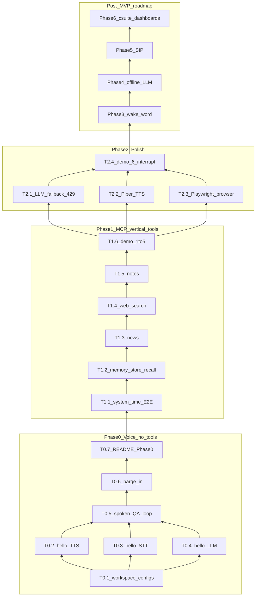

# Implementation Plan: forge-os

## Overview

Build Forge — a Linux-first, local-first FRIDAY-style voice assistant — in vertical slices aligned with [SPEC.md](../SPEC.md) §6 / §13. Holiday MVP = **Phases 0–2** (spoken Q&A → MCP tools → browser + TTS/LLM polish). **Phases 3–6** are an explicit post-MVP roadmap (wake word, offline LLM, SIP, C-suite dashboards), not in the critical path for the holiday demo.

**No application code in this planning step** — this document + `todo.md` are the implementation contract.

## Architecture decisions (locked)

| Decision | Choice | Rationale |
|----------|--------|-----------|
| LLM | Groq `llama-3.3-70b-versatile`; fallbacks `openai/gpt-oss-20b` → `llama-3.1-8b-instant` | Tool quality first; free-tier escape hatch |
| MCP | SSE primary; stdio debug | Two-process Friday split |
| Barge-in | Cancel TTS + abandon in-flight tools | User changed intent |
| Platform | Linux-first; macOS best-effort; Windows unsupported MVP | Author machine |
| TTS | edge-tts `en-US-GuyNeural` → Piper | Free; offline fallback |
| STT | faster-whisper `base`/cpu default | Demo-usable on laptop |
| Memory | SQLite + Chroma | Simple DX |
| Search | DuckDuckGo; SearXNG later | No API key |
| Post-MVP | Phases 3–6 per SPEC §12 | User-requested roadmap; keep free/self-hosted |

## Dependency graph

## Vertical slices (not horizontal “all packages first”)

### Phase 0 — Hello Forge (no MCP)

| Slice | Delivers | Tasks |
|-------|----------|-------|
| Foundation | `uv sync` + configs so slices have a home | T0.1 |
| Speak | Text → speakers via edge-tts | T0.2 |
| Hear | Mic → transcript via Whisper | T0.3 |
| Think | Text → Groq → text (persona) | T0.4 |
| Converse | Full spoken Q&A loop | T0.5–T0.6 |
| Docs | Phase 0 quickstart | T0.7 |

T0.2 / T0.3 / T0.4 may proceed in parallel after T0.1.

### Phase 1 — One capability at a time over MCP

Do **not** build every tool before wiring voice. First vertical: MCP server + `system_time` + dynamic tool loop end-to-end. Then memory, news, search, notes as separate slices.

| Slice | User story | Tasks |
|-------|------------|-------|
| Time | “What time is it?” | T1.1 |
| Memory | Remember / recall across restart | T1.2 |
| News | Top tech headlines | T1.3 |
| Search | DDG one useful fact | T1.4 |
| Notes | Structured notes | T1.5 |
| Demo gate | SPEC demo script 1–5 | T1.6 |

### Phase 2 — Demo polish

| Slice | Delivers | Tasks |
|-------|----------|-------|
| Rate-limit survival | Groq fallback chain | T2.1 |
| Offline voice | Piper fallback | T2.2 |
| Browser | example.com title | T2.3 |
| Showcase gate | Demo 6–7 | T2.4 |

### Post-MVP (Phases 3–6) — backlog only until Phase 2 exits

| Phase | Outcome | Depends on |
|-------|---------|------------|
| 3 Always-on wake word | Background openWakeWord “Hey Forge” | Stable Phase 0 mic/VAD |
| 4 Zero-cloud offline LLM | Ollama (or equiv.) when offline; Groq default online | LLM client abstraction from T0.4/T2.1 |
| 5 Phone / SIP | Self-hosted SIP softphone path | Stable voice loop + TTS/STT |
| 6 C-suite dashboards | Multi-agent roles + local web UI | MCP tools mature; memory; Phase 1–2 |

## PR mapping (SPEC recommended commits)

| PR | Title | Tasks | Spec |
|----|-------|-------|------|
| PR0 | docs: SPEC (+ this plan) | SPEC / tasks | docs |
| PR1 | chore: uv workspace + configs | T0.1 | §6 Phase 0 |
| PR2 | feat(voice): hello STT→LLM→TTS | T0.2–T0.7 | §6 Phase 0 |
| PR3 | feat(mcp): tools + memory | T1.1–T1.6 | §6 Phase 1 |
| PR4 | feat: playwright + piper + LLM fallback | T2.1–T2.4 | §6 Phase 2 |
| Later | Phases 3–6 | Backlog IDs T3.*–T6.* | §12 |

## Checkpoints

### Checkpoint A — After T0.7 (Phase 0 exit)

- [ ] Spoken Q&A works with **zero** MCP
- [ ] Barge-in stops TTS
- [ ] `uv sync` + README Phase 0 path works on Linux CPU
- [ ] Human review before MCP work

### Checkpoint B — After T1.6 (Phase 1 exit)

- [ ] `uv run pytest` green for memory/tools
- [ ] Demo script items 1–5 pass
- [ ] Tools loaded dynamically from MCP `list_tools`
- [ ] Human review before Phase 2

### Checkpoint C — After T2.4 (Holiday MVP done)

- [ ] Demo script items 6–7 pass
- [ ] Piper path works offline / on edge failure
- [ ] Groq 429 triggers fallback (tested)
- [ ] Ready for holiday showcase; Phases 3–6 remain backlog

### Checkpoint D — Before starting any post-MVP phase

- [ ] Re-read SPEC §12 for that phase
- [ ] Confirm still free/self-hosted only
- [ ] Write phase-specific mini-tasks before coding

## Risks and mitigations

| Risk | Impact | Mitigation |
|------|--------|------------|
| Groq 429 mid-demo | High | T2.1 early in Phase 2; practice fallback |
| Whisper CPU latency | Med | Keep `base`; don’t block on `small` |
| edge-tts down | Med | T2.2 Piper |
| Scope creep into Phases 3–6 before demo | High | Hard gate: no T3+ until Checkpoint C |
| SIP / C-suite underestimate | High | Treat as multi-week epics; spike first task in each phase |
| Offline LLM quality | Med | Keep Groq default; Ollama opt-in |

## Parallelization

| Safe in parallel | Must be sequential |
|------------------|--------------------|
| T0.2, T0.3, T0.4 after T0.1 | T0.5 after those three |
| T2.1, T2.2, T2.3 after T1.6 | T1.1 → T1.2 → … → T1.6 |
| Docs/tests for finished slices | T2.4 after T2.1–T2.3 |

## Open questions

**None blocking Phases 0–2.** SPEC grill decisions are locked.

Post-MVP phases will need fresh decisions when started (e.g. which Ollama model; which SIP stack; dashboard tech). Those are **not** blockers for MVP tasks.

## Human-blocked tasks (Phases 0–2)

**None.**
